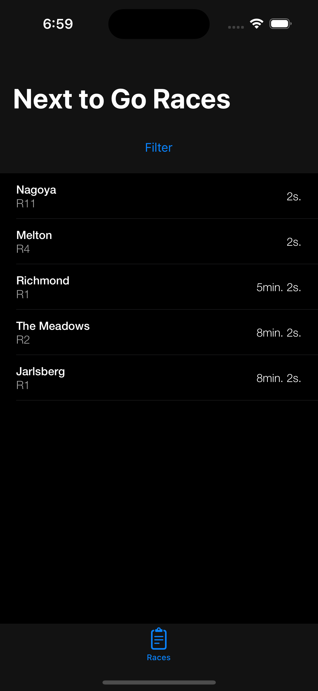
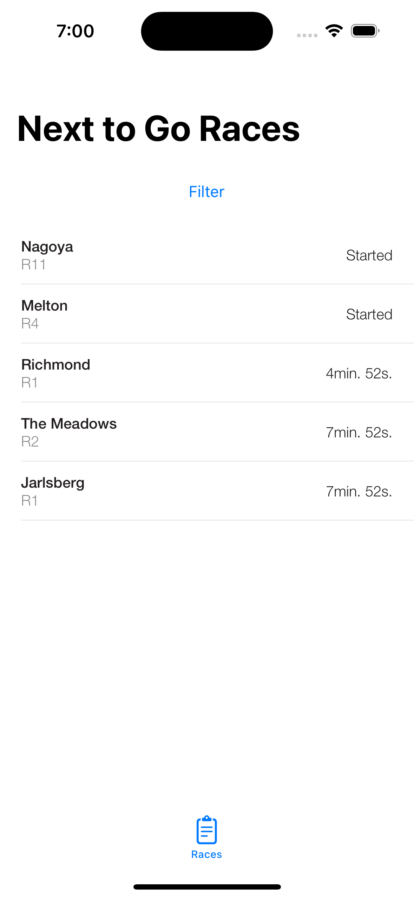
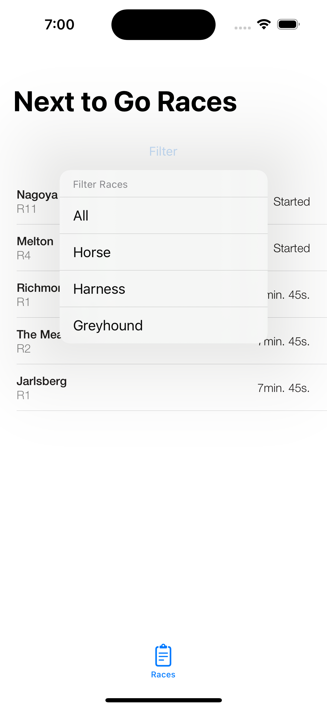
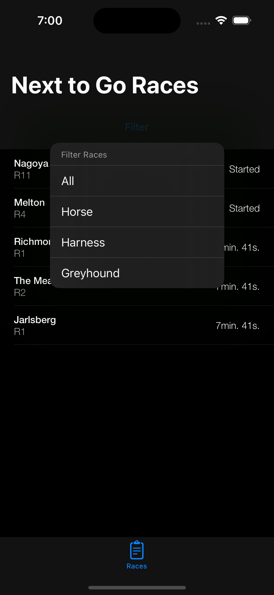
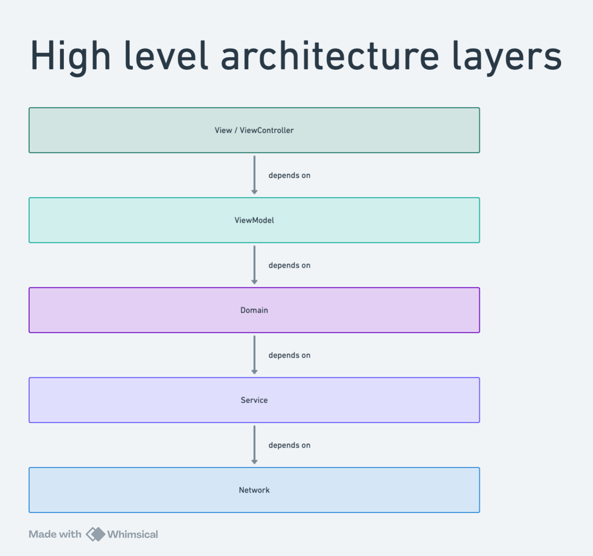
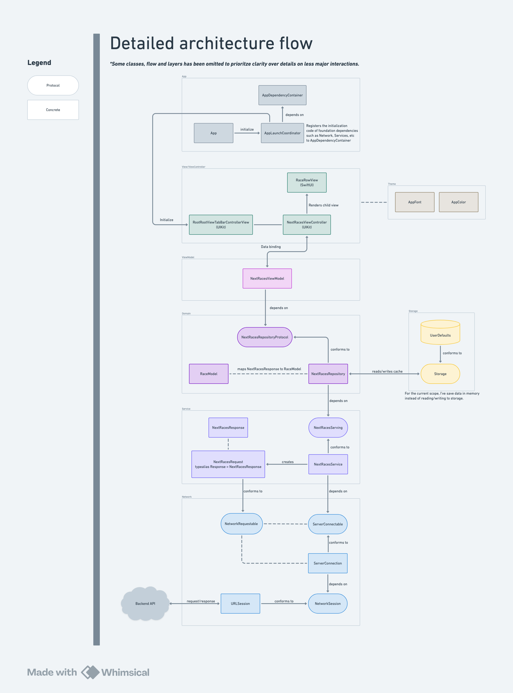

# App

## Project setup

### My working environment
* Xcode 15.2 (15C500b)
* Project target min deployment iOS 17.2
* macOS Sonoma 14.3

## Features

### Next to Go Races
|Light mode|Dark mode|
|-|-|
|||

### Next to Go Races (started)
|Light mode|Dark mode|
|-|-|
|||

### Filters
|Light mode|Dark mode|
|-|-|
|||

## UI technology choice
I decided to go with a hybrid approach using UIKit parent views and SwiftUI child views. In my opinion, UIKit's navigation tends to scale better than SwiftUI’s navigation system.
UIKit allows for more flexibility and control, which enables easier modularisation and management of complex navigation logic.
Although SwiftUI offers more concise code syntax, the tight coupling of navigation with views makes it hard to decouple navigation.

By combining UIKit's navigation capabilities with SwiftUI's declarative UI components, I felt that I was able to leverage the strengths of both frameworks.
In conclusion, I thought that the hybrid approach enables a more manageable navigation while taking advantage of SwiftUI's modern UI development, and wanted to give it a try. The hybrid approach is definitely more complex and costly compared to building a full SwiftUI app with direct bindings between Views and Models. However, the benefits, such as the ease of navigation modularity and more precise control over parent layouts, make the extra effort worthwhile in my opinion. That said, I acknowledge that this is important to discuss this with the team before making the decision in a real-world scenario.

## App Architecture

### Overview
The architecture is structured in layers to promote separation of concerns, maintainability, and scalability.
Each layer has distinct responsibilities and interacts with the other layers in a predictable manner.
This modularity ensures high testability, ease of reasoning and maintainability. To keep things simple and understandable, I will focus on the main architectural layers only.

Below is a breakdown of the architecture:

### App layers

#### View/ViewController
This layer contains the ViewControllers and Views, which form the user interface of the application.
It is responsible for displaying data to the user and capturing user interactions.
#### ViewModel
Contains ViewModels that are responsible for fetching data from Repositories to provide data bindings for the ViewController or View.
This decouples the Views and ViewControllers from the rest of the layers and enables the them to communicate exclusively through the ViewModel for data and state management.
#### Domain
The Domain layer serves as an intermediary between the Service layer and the ViewModel layer.
Its primary role is to avoid ViewModel from having direct knowledge about the data's origins, whether from network or local storage. This layer contains repositories, domain models, and mapping logic from Network response models.
#### Service
The Service layer is tasked with creating and managing various types of network requests and responses.
This layer prevents the Network layer from becoming excessively bloated with details about many different API calls required by the App.
It helps maintain a generic Network layer by abstracting the specifics of network interactions out.
#### Network
The Network layer contains generic network request implementations and offers an interface for the Service layer to consume.
This enables Service layer to execute specific network requests and handle responses while being abstracted from the implementation details of network requests.

### High level diagram
I recommend to view the [diagram](https://whimsical.com/entain-app-RpdER2kNEwqXa1vpWir143@2bsEvpTYSt1Hj5CWwMNZozo6V67wpHi6t4b) in Whimsical for native resolution.

### Detailed Diagram
Below is a detailed diagram using the data flow of NextRacesRequest/Response to Views as an example. I hope this aids understanding my code by being able to refer to diagram when exploring the code implementation.

I recommend to view the [diagram](https://whimsical.com/entain-app-RpdER2kNEwqXa1vpWir143@2bsEvpTYSt1HjBhRHyAKDUBtu2h1Y3K7jSK) in Whimsical for native resolution.

## Ending Notes
Due to time constraints, I want to highlight some of the things that I was unable to do:

* Abstract each layer into their own respective modules with a public interface counterpart.
For example:
  * NetworkInternal module (Contains network internal implementations)
  * Network module (Contains network public facing interface and classes)
  * ServiceInternal module (Contains service internal implementations)
  * Service module (Contains service public facing interface and classes)
  * ... etc
* Cache network response/model in Repository
* Add a Developer screen to manage feature flags and endpoint environment.
* Localize string copies
* Expand more on the Router for presenting and navigation.
* Lean down NextRacesViewModel by extracting the timer logic out of it into a StartTimeObserver class
* UITesting and Snapshot testing
